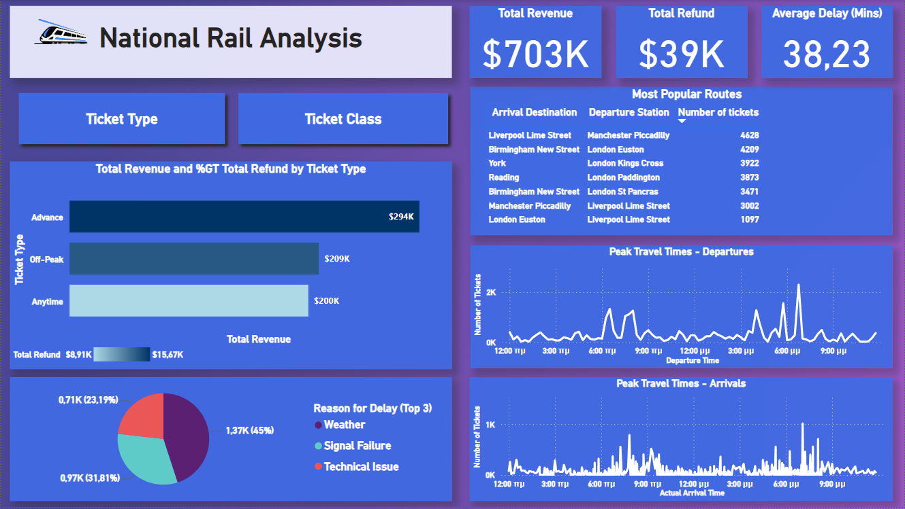

# Rail Challenge Exploratory Data Analysis

## View of the report
Download report here : https://github.com/Alexandros-Korolis/Rail-Challenge-EDA/blob/main/EDA_National_Rail.pbix

## Challenge Objective
For the Maven Rail Challenge, you'll play the role of a BI Developer for National Rail, a company that provides business services to passenger train operators in England, Scotland, and Wales.

You've been asked by your manager to create an <strong>exploratory dashboard</strong> that helps them:
&middot;Identify the most popular routes
&middot;Determine peak travel times
&middot;Analyze revenue from different ticket types & classes
&middot;Diagnose on-time performance and contributing factors

## About The Data Set
The data contains mock train ticket sales for National Rail in the UK, from January to April 2024, including details on the type of ticket, the date & time for each journey, the departure & arrival stations, the ticket price, and more.

## Report 
&middot;From the report, we can see that the top 3 most popular routes are Manchester Piccadilly to Liverpool Lime Street (4,628 total tickets), London Euston to Birmingham New Street (4,209 total tickets), and London Kings Cross to York (3,922 total tickets).

&middot;Peak travel times are primarily between 6:30 to 8:00 in the morning and 4:00 to 6:45 in the afternoon.

&middot;The total revenue generated is approximately $703,000, with $39,000 in refunds. The largest contribution to total revenue comes from passengers purchasing standard class tickets.

&middot;Regarding ticket types, advance tickets generate around $294,000 in revenue.

&middot;The average delay is about 38 minutes, with the top three causes being weather (45%), signal failure (32%), and technical issues (23%).

&middot;Lastly, it’s observed that passengers with standard class tickets are more likely to request refunds (83%) compared to those with first class tickets (17%).

